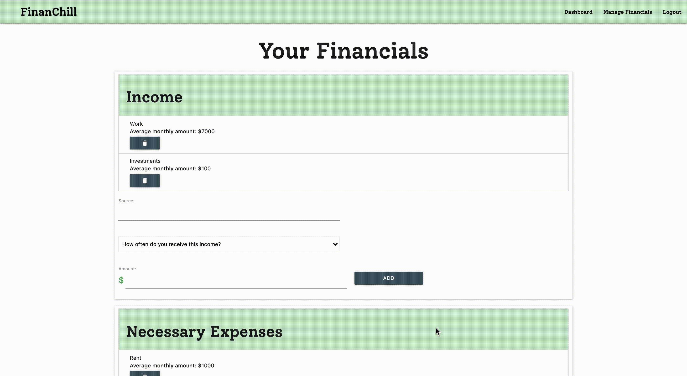
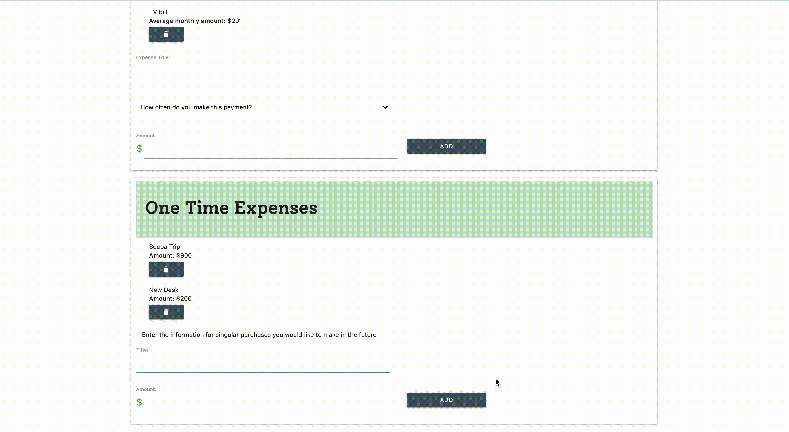
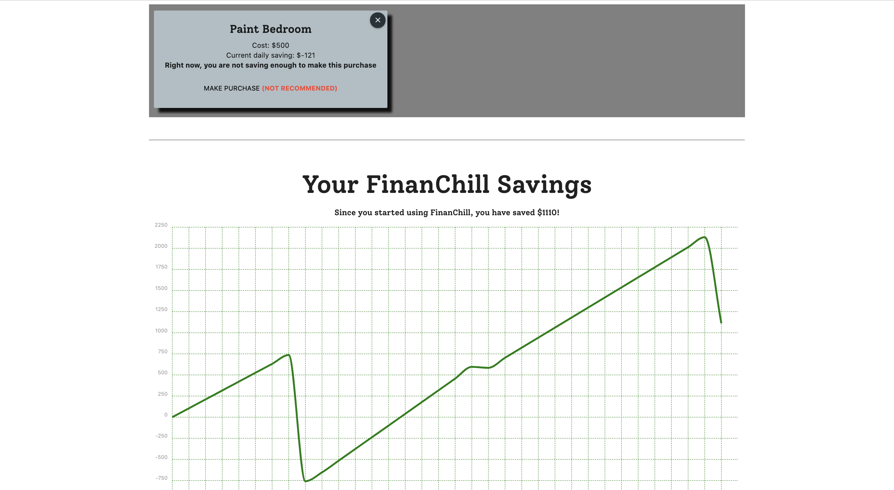

# FinanChill

<br>


## Contents

* [Installation](#Installation)
* [Built With](#built-with)
    * [npm Packages](#npm-packages)
* [Application Functionality](#application-functionality)
    * [See Deployed Application](https://desolate-sierra-38032.herokuapp.com/)
* [Code Snippets](#code-snippets)
* [Developers](#developers)

<br>
<hr>
<br>

## Installation

To access this code on your local machine, follow these steps:

1. Clone the repository onto your local machine using terminal:
```
git clone https://github.com/GabeSucich/BudgetingApp.git
```
<br>

2. Navigate into the cloned directory and install the npm dependencies contained in the package.json file by running the following in terminal:
```
npm install
```
<br>

3. Ensure that you have [mySQL workbench](https://www.mysql.com/products/workbench/) installed and running on your computer. In the `config.json` file within the `config` directory, update the information contained within the `development` object to match your mySQL credentials.

4. In your mySQL workbench, copy and paste the code in `schema.sql` withing the `Db` directory, and run to configure development databse.

<br>
<hr>
<br>

## Built with

* [HTML/CSS](https://developer.mozilla.org/en-US/docs/Web/HTML)
* [Materialize](https://materializecss.com/)
* [Javascript](https://developer.mozilla.org/en-US/docs/Web/JavaScript)
* [jQuery](https://jquery.com/)

### npm Packages

* [express](https://www.npmjs.com/package/express)
* [express-handlebars](https://www.npmjs.com/package/express-handlebars)
* [express-session](https://www.npmjs.com/package/express-session)
* [mysql2](https://www.npmjs.com/package/mysql2)
* [sequelize](https://www.npmjs.com/package/sequelize)
* [passport](https://www.npmjs.com/package/passport)
* [passport-local](https://www.npmjs.com/package/passport-local)
* [bcryptjs](https://www.npmjs.com/package/bcryptjs)
* [moment](https://www.npmjs.com/package/moment)


<br>
<hr>
<br>

## Application Functionality

### [See deployed application](https://desolate-sierra-38032.herokuapp.com/)

FinanChill allows you to manage all the different facets of your budget in one place. On the Financials page, you can add new expenses. Here, our user is adding a morning cup of coffee to the unnecessary expense section of the budget.


Users can also update changes to their budgets. Our user just got a raise, and wants to incorporate this into FinanChill's budget tracking. Only current budget elements are shown on the Financials page, and so the user will delete the old income element and replace it with a new one. However, FinanChill will still keep track of the dates between which the old income amount was active, and this will be reflected in another part of the app.



Anytime a user is considering making a purchase which, they can add it in the "One Time Expenses" field. These expenses won't be immediately added to the budget -- the user will have to confirm them in a different part of the app. Here, our user is adding a new laptop to a list of future purchases under consideration.



The Dashboard displays all of the user's current budgeting data. The user can choose to browse budget information by category, or to view all budgeting information together.


FinanChill keeps track of all of the user's financial data -- past and present -- from the time that they sign up. This data is compiled and presented graphically on the dashboard as a way of directly indicating budget progress. In this example, our user has been diligently saving for about a month. The dips in the graph correspond to one-time purchases that the user made, but the trend in savings is generally upward.

Our user is considering spending on a scuba trip and on a new desk. On these purchase cards, FinanChill displays how many days it would take to save up for these purchases with the user's current budgeting. Our user has saved over $2000 this month, and decides to reward his or herself by splurging on the scuba trip. When the "MAKE PURCHASE" button is clicked on the scuba card, the purchases is automatically reflected in the budget chart!


Consider in this example the user gets in a boating accident on the scuba trip, and has to pay $2000 upfront in repair fees. After adding this in the "One Time Expenses" section of the Financials page, the user confirms this puchase on the dashboard, and the graph is updated. Since beginning with FinanChill, the budget is now negative, and FinanChill updates the display to reflect this.


Now, the user heeds FinanChill's suggestion and decides to cut back on spending. He or she can choose to remove the New Desk purchase from consideration, and it will disappear from the dashboard. This extra step is FinanChill's way of ensuring that users consider their singular expenses carefully -- purchases can only be confirmed from the page where a user has budget data displayed.


As a final example of FinanChill's functionality, consider if the user had not gotten in the boating accident, but instead decided to quit whatever job he or she is working. The day after quitting, our user's budget will not yet be negative. However, with each jobless day, less money is going out of the budget than coming in. FinanChill will process this, and change the display to recommend against future purchases to protect the user's budget.



<br>
<hr>
<br>

## Code Snippets

<br>
<hr>
<br>

## Developers

### Gabe Sucich


* [Portfolio](https://gabesucich.github.io/UpdatedPortfolio/)
* [Github Account](https://github.com/GabeSucich)

***

### Preeti Gupta


* [Github Account](https://github.com/preeti1234567)

***

### Aidan Sweeny


* [Github Account](https://github.com/AidanSweeny)

